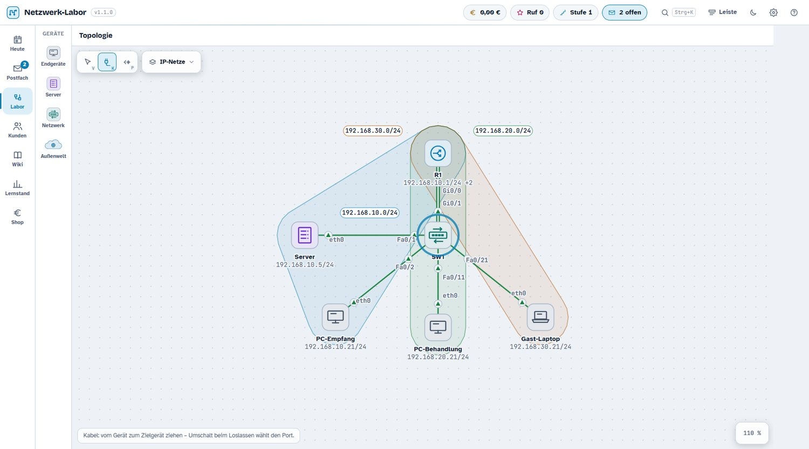
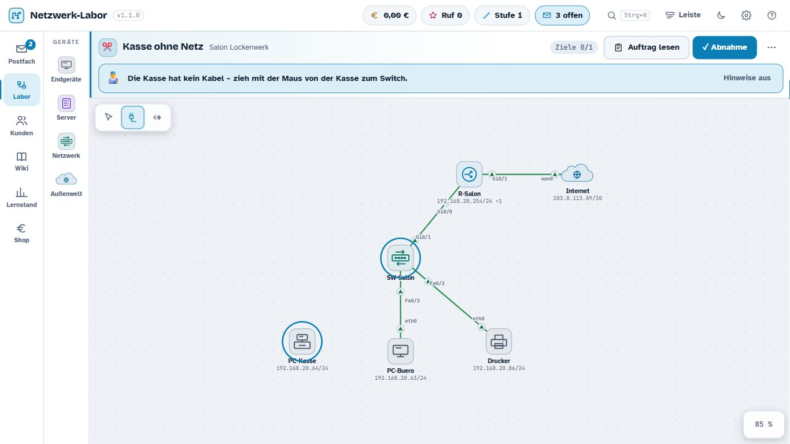
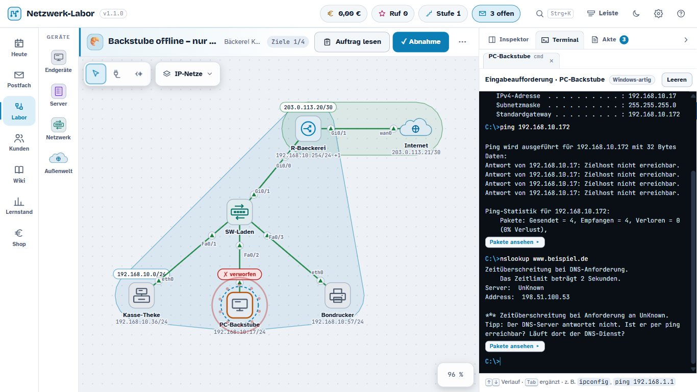
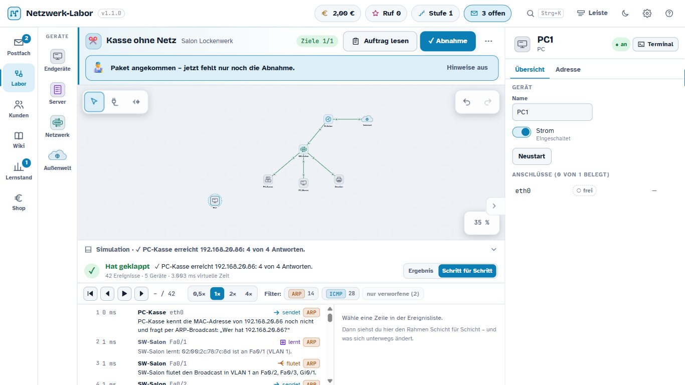
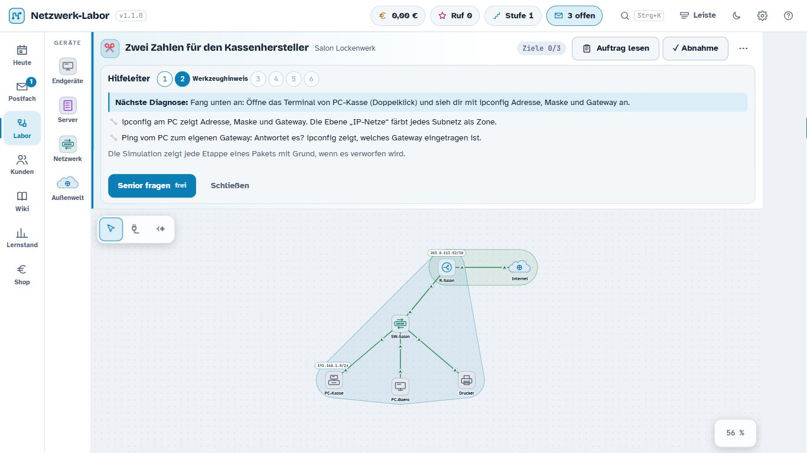
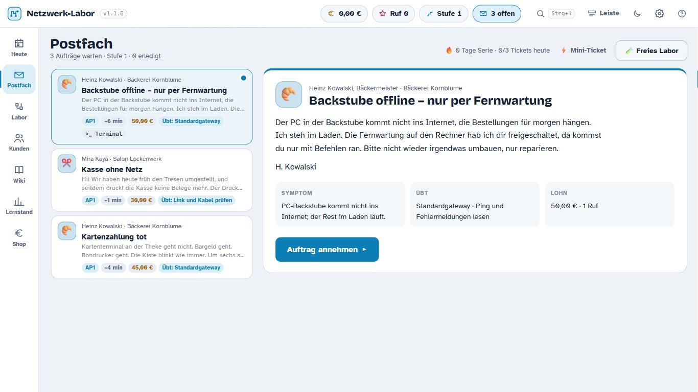
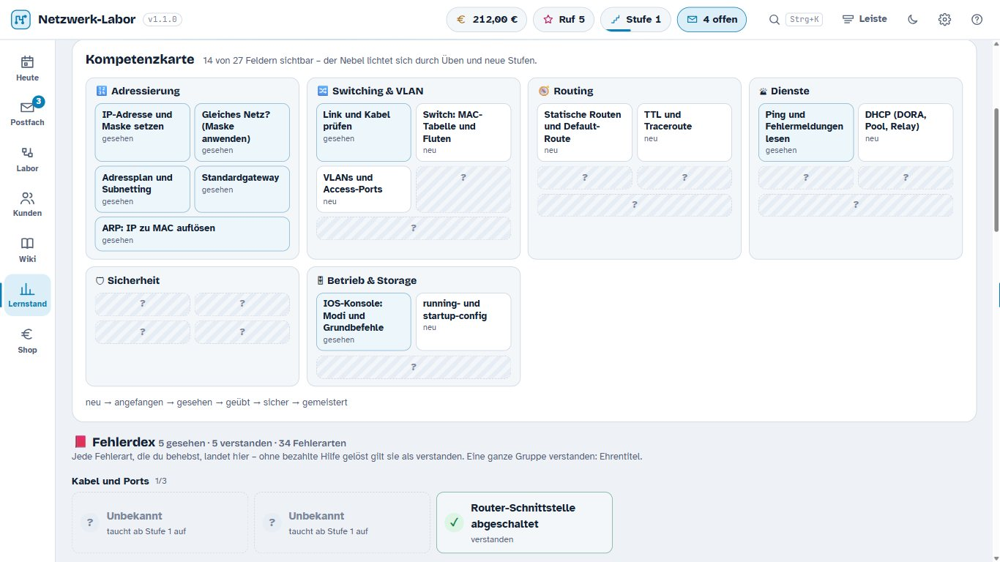

# Netzwerk-Labor

**Ein Netzwerk-Simulator zum Spielen: Du bist das Ein-Mann-Systemhaus.**
Kunden schicken Tickets („Die Kasse druckt nicht mehr"), du löst sie in einem echten
Simulator — Geräte verkabeln, IP, VLAN, Routen, ACL, NAT, DHCP, DNS, Firewall. Jedes Paket
ist wirklich unterwegs, Frame für Frame, und du siehst, wo und warum es verworfen wird.

Lernspiel für **Fachinformatiker Systemintegration (IHK AP1/AP2)**. Kein Cisco-Produkt.
Läuft lokal und offline; nichts wird gesendet.




---

## Sofort spielen

| Weg | Wie | Was du brauchst |
|---|---|---|
| **Im Browser** | **[vexx-oss.github.io/NetLab](https://vexx-oss.github.io/NetLab/)** öffnen | nur einen Browser |
| **Eine Datei** | **[Netzwerk-Labor.html herunterladen](https://github.com/Vexx-oss/NetLab/releases/latest/download/Netzwerk-Labor.html)** (2,1 MB), Doppelklick | nur einen Browser |
| **Zum Entpacken** | [Netzwerk-Labor-1.2.3-Browser.zip](https://github.com/Vexx-oss/NetLab/releases/latest): Spiel, Anleitungen, Lizenztexte | nur einen Browser |
| **Windows-Programm** | **[Netzwerk-Labor.exe herunterladen](https://github.com/Vexx-oss/NetLab/releases/latest/download/Netzwerk-Labor.exe)** (8,2 MB) — mit Leiste am Bildschirmrand, Tray-Symbol und globalem Tastenkürzel | Windows 10/11 |

Alle drei Wege liefern dieselbe Fassung `1.2.3`. Die Anhänge der Release laden **direkt
herunter** (gemessen: `Content-Disposition: attachment`) — ein Klick, kein Umweg.

> **Zur Windows-`.exe`:** Sie ist **1.2.3** (gebaut am 07.10.2026, SHA256 `E2735D79…5DD68`) und bringt
> Leiste, Tray und globales Tastenkürzel. Sie **hängt seit dem 07.10.2026 automatisch an jeder
> Veröffentlichung** — gebaut von einem Windows-Läufer in
> [`.github/workflows/release.yml`](.github/workflows/release.yml), damit der Download-Link stabil bleibt:
> `https://github.com/Vexx-oss/NetLab/releases/latest/download/Netzwerk-Labor.exe`. Ins Git gehört sie
> weiterhin **nicht** (8 MB je Bau); auf dem Entwicklungsrechner liegt sie unter
> `Programm/Netzwerk-Labor.exe`.
> **Ihr Start ist gemessen:** die Abnahme `python tools/q-echt.py` lief im echten Programm
> durch — Fenster offen, erster Auftrag mit echter Maus gelöst, 5 ★, 0 Fehler,
> Fernwartungs-Schild sichtbar. Bilder: `Nachweise/1.2-Q/`.

`Netzwerk-Labor.html` liegt direkt im Repositorium, damit der Download **einen Klick**
braucht und nicht erst ein Release. Es ist dieselbe Datei, die auf GitHub Pages läuft —
gleiche Prüfsumme, nachgewiesen von `python tools/seite-pruefen.py`.

Die Einzeldatei ist das **ganze Spiel in einer Datei** — Schriften eingebettet, kein
Nachladen, kein Installieren, kein Internet. Windows, Linux, macOS: alles mit einem
Browser. Belegt: 2.269.597 Bytes (2,16 MB), **0 Außenverweise** (geprüft über `<link>`,
`<script src>`, `` und `url()`), Start im echten Browser über `file://` gemessen
(`python tools/starttest.py`).

> **Warum dieselben 2,2 MB zweimal im Git liegen** (`Netzwerk-Labor.html` im
> Wurzelverzeichnis und `docs/index.html`) — bewusst so, nicht versehentlich:
> `docs/index.html` ist die Datei, die GitHub Pages ausliefert (`seite.yml` stellt genau
> `docs/index.html` und `docs/bilder/` zusammen), und `Netzwerk-Labor.html` ist der
> Ein-Klick-Download, auf den dieses README verweist. Beide entstehen aus demselben Bau
> (`python tools/einfach.py`) und **müssen byte-gleich sein** — der Bau schreibt sie
> nacheinander aus derselben Quelle; `python tools/seite-pruefen.py` prüft die Gleichheit.
> Wer eine davon ändert oder löscht, bricht den jeweils anderen Weg. Die langen Notizen
> liegen in `docs/` bzw. `docs/entwicklung/` und werden **nicht** veröffentlicht; die
> Übersicht steht in [`docs/INHALT.md`](docs/INHALT.md).

Gegenüber dem Windows-Programm fehlen nur die Fenster-Funktionen: Leiste am
Bildschirmrand, Tray-Symbol, immer im Vordergrund, globales Tastenkürzel. Das Spiel sagt
das an der passenden Stelle selbst an.

> **Windows-Programm, falls kein Fenster erscheint:** `Integritaet-reparieren.cmd`
> doppelklicken. Der gemessene Grund ist ein Integritätslabel „Niedrig" auf dem Ordner
> (Überrest einer Werkzeug-Sandbox): die `.exe` erbt es, läuft als Low-Prozess und darf
> `%LOCALAPPDATA%` nicht beschreiben, worauf die WebView2-Laufzeit ihr Profil nicht anlegen
> kann (`failed to create webview`, `0x800700AA`). Details: [`Nachweise/1.2-Start/BEFUND.md`](Nachweise/1.2-Start/BEFUND.md).

Die **Spielstände von Browser- und Windows-Fassung sind getrennt** und werden nicht
geteilt: Browser im `localStorage`, Windows unter
`%APPDATA%\de.fisi.netzwerklabor\spielstand.json`.

---

## Die ersten fünf Minuten

1. **Postfach** öffnen und die erste Kundenmail lesen.
2. **„Auftrag annehmen"** — das Netz erscheint im Labor.
3. Ein Gerät **anklicken**: rechts zeigt der **Inspektor** Adressen, Ports, VLAN, Routen,
   ACL, NAT; der Reiter **Konsole** ist das IOS-ähnliche Terminal.
4. **Werkzeuge** oben links in der Laborfläche, Kurztaste in Klammern:
   **V** auswählen und verschieben · **K** Kabel verlegen · **P** Ping-Werkzeug
   (jeweils von Gerät zu Gerät ziehen). Gerät **doppelklicken** oder **T** öffnet sein
   Terminal.
5. Nach einem Ping unten **„In Simulation öffnen"**: das Paket Schritt für Schritt,
   Schicht für Schicht.
6. Zum Schluss **„Abnahme anfordern"** — der Kunde prüft selbst nach, auch ob du dabei
   etwas anderes kaputt gemacht hast.

**Fehler kosten nichts.** Die Hilfeleiter (Checkliste, Werkzeugtipp, Frage vom Senior) ist
am Anfang gratis und führt notfalls bis zur vorgeführten Lösung.

<table>
<tr>
<td width="50%"><br><em>Der erste Auftrag: Ticket, Ziele, Senioren-Hinweis.</em></td>
<td width="50%"><br><em>Konsole und Terminal bei der Fehlersuche.</em></td>
</tr>
<tr>
<td width="50%"><br><em>Simulation auf Frame-Ebene: 42 Ereignisse, Filter, PDU-Ansicht.</em></td>
<td width="50%"><br><em>Die Hilfeleiter — Stufe 2 von 6, Senior fragen gratis.</em></td>
</tr>
</table>

Weitere Bilder und die Herkunft jeder Aufnahme: [`docs/bilder/HERKUNFT.md`](docs/bilder/HERKUNFT.md).

---

## Was drin ist

**Simulation auf Frame-Ebene.** ARP, Switching mit MAC-Lernen, VLAN und 802.1Q,
Router-on-a-Stick, statische Routen, ICMP (Timeout gegen unreachable, TTL), ACL, NAT/PAT,
DHCP mit Relay, Reservierung, Lease-Laufzeit und Snooping, DNS, TCP-Handshake, HTTP,
Firewall mit Zonen und Port-Weiterleitung, Internet als Kulisse, Broadcast-Sturm.
Jede Antwort ist aus Paketen hergeleitet, nichts ist vorgetäuscht.

**IOS-ähnliche Konsole.** Modi, Kurzformen, `?`, Tab-Vervollständigung, `do`,
running/startup-config, `write erase`. Dazu ein Windows-Terminal (`ipconfig`, `ping`,
`tracert`, `arp -a`, `nslookup`). Befehle, die nicht belegt sind, werden als solche
gekennzeichnet.

**Aufträge.** 37 handgeschriebene Tickets in 5 Karrierestufen (Salon, Bäckerei,
Schreibbüro, Arztpraxis, Autohaus, Mittelstand) inklusive 4 Projekten, dazu unbegrenzt
generierte Tickets aus 5 Netzvorlagen × 30 Fehlerinjektoren — jede Variante wird
automatisch geprüft. 83 Mini-Tickets für die Leiste.

**Spielschichten.** Hilfeleiter 0–6, Abnahme mit Regressions- und Neustart-Test (nur
Gespeichertes überlebt), Sterne, Euro und Ruf, Wartungsverträge, Playbooks,
Offline-Bericht, Prüfungstag nach IHK-Notenschlüssel.

**Lernen statt Klicken.** Können ist die Währung: Wer etwas sicher beherrscht, darf es
automatisieren. Wiederholungen kommen im richtigen Abstand zurück (Lernmotor: Leitner-Fächer,
1/3/7/14/30 Tage), Fehler landen im Fehlerheft, 15 Abzeichen belohnen Arbeitsweisen.

<table>
<tr>
<td width="50%"><br><em>Aufträge kommen als Kundenmail — Symptom, nicht Ursache.</em></td>
<td width="50%"><br><em>Lernstand: Kompetenzkarte und Fehlerheft.</em></td>
</tr>
</table>

---

## Mitmachen: holen, bauen, ziehen

**Einmal holen** (git ist alles, was du brauchst — Node und Python nur zum Bauen und Testen):

```bash
git clone https://github.com/Vexx-oss/NetLab.git
cd NetLab
git switch ausbau-1.2          # der Zweig, in dem gearbeitet wird (und der veröffentlicht wird)
```

**Spielen ohne zu bauen:** [vexx-oss.github.io/NetLab](https://vexx-oss.github.io/NetLab/) öffnen,
oder die Einzeldatei aus dem [Release](https://github.com/Vexx-oss/NetLab/releases/latest)
herunterladen. Beides ist immer der neueste Stand.

**Selbst bauen** (die Reihenfolge ist wichtig, `bauen.py` zuerst):

```bash
python bauen.py                # src/ -> web/index.html
python tools/einfach.py        # web/ -> docs/index.html   (dieselbe Datei als Netzwerk-Labor.html)
sh tools/test.sh               # 251 Tests, headless in Node
python tools/abnahme.py        # die ganze Kette in einem Befehl
```

Für die Android-Fassung kommt das Android-SDK dazu (`android/bauen.py`, ~5 s), für die
Windows-Hülle Rust (`cargo tauri build`, Minuten). Genaueres steht in
[`docs/Bauen.md`](docs/Bauen.md).

**Updates ziehen** — je nachdem, was du benutzt:

| Was du hast | Wie du aktualisierst |
|---|---|
| einen Klon | `git pull` — danach `python bauen.py` und `python tools/einfach.py`, wenn du die Seite selbst baust |
| die Browser-Einzeldatei | neue aus dem [Release](https://github.com/Vexx-oss/NetLab/releases/latest) laden — oder einfach die Seite im Netz benutzen, die ist immer aktuell |
| die App auf dem Telefon | neue `.apk` aus `Programm/` (bzw. vom Release) antippen und **über** die alte installieren — der `versionCode` steigt mit jeder Fassung, deshalb klappt das ohne Deinstallieren |
| das Windows-Programm | `git pull`, dann `pwsh -File shell/entwickeln.ps1` (Debug, Sekunden) oder `cargo tauri build` in `shell/src-tauri` (Auslieferung) |

**Wenn du selbst etwas änderst:** arbeite auf `ausbau-1.2`, halte dich an
[`AGENTS.md`](AGENTS.md) (kurz: keine Prozesse nach Namen beenden, kein Push ohne Absprache,
nichts behaupten, was nicht gemessen ist) — und am Ende die acht Schritte aus
[`docs/SITZUNGSABSCHLUSS.md`](docs/SITZUNGSABSCHLUSS.md) durchgehen. Dort steht auch, wie die
Fassungsnummer gezogen wird (`python tools/fassung-ziehen.py --neu 1.2.3 --setzen`) und wie man
nachmisst, dass die Veröffentlichung wirklich den neuen Stand liefert.

Ein Beitrag ist willkommen, wenn er **spielbar** bleibt: nach jedem Schritt muss das Spiel
laufen, `sh tools/test.sh` grün sein und `python tools/ethos.py` nicht schlechter als der
eingefrorene Stand. Ein grüner Test ohne Wirkung im Programm gilt hier ausdrücklich **nicht**
als fertig.

## Für Interessierte: wie es gebaut ist

Oberfläche und Logik in **schlichtem JavaScript ohne Bundler**; die Rust-Hülle ist dünn
(Tauri 2, Fenster, Leiste, Tray, Speichern, Autostart). `src/` ist in Schichten gelegt —
`kern` · `modell` · `sim` · `cli` · `daten` · `spiel` · `plattform` · `ui` · `stil`.
`sim/` und `cli/` laufen **headless**: kein DOM, keine Uhr, kein Zufall ohne Seed. Das ist
die Grundlage dafür, dass die Simulation reproduzierbar getestet werden kann.

```
107 Module · 20.706 Zeilen JavaScript · 35 Testdateien · 251/251 Tests grün
```

```bash
python bauen.py                      # src/ -> web/index.html (Einzeldatei-Bau des Programms)
python tools/einfach.py              # web/ -> docs/index.html (DAS Spiel als eine Datei)
sh tools/test.sh                     # Tests headless in Node — meldet 251/251 grün
node tools/sim-stand.js              # Simulation gegen den versionierten Referenzstand
python tools/klassen.py              # Abgleich: Klassen im JS <-> Regeln im CSS
python tools/ethos.py                # 12 Minimalismus-Regeln gegen tests/stil-stand.json
python tools/starttest.py            # startet docs/index.html im echten Browser und misst
python tools/menueprobe.py --lauf    # die tiefen Menüebenen in 5 Profilen messen
python tools/paket.py                # Auslieferungspaket -> dist/ (Ordner + ZIP, geprüft)
python tools/lernmotor.py            # Kopie des Lernmotors gegen die Spielhalle prüfen
python android/bauen.py              # Spiel -> Einzeldatei -> APK -> Prüfung (~5 s)
python tools/abnahme.py              # die ganze Kette: 14 Prüfungen, ein Befehl
```

`python tools/abnahme.py` läuft in einem Durchgang durch alles: Tests, Klassen-Abgleich,
Simulations-Referenz, Lernmotor (drei Nachweise), beide Bauwege, Einzeldatei, Start im
echten Browser, Paketbau und die Gegenprobe am entpackten Paket. Gemessener Stand:
**14/14 grün** (rund 65 s).

`tools/test.sh` braucht Node. In eingeschränkten Umgebungen verlässlich:

```bash
& "C:\Program Files\Git\bin\bash.exe" -c 'export PATH=/usr/bin:/bin:$PATH; sh tools/test.sh'
```

Die **Windows-`.exe`** baut man selbst (Rust und WebView2 nötig, `python bauen.py` immer
zuerst):

```bash
cd shell/src-tauri
CARGO_TARGET_DIR=<schneller-Ordner>/target cargo tauri build --no-bundle
```

### Ein Hinweis zum Nachbauen

Seit dem Grundgerüst holten `bauen.py`, `tests/run.js` und `tools/sim-stand.js` den
Lernmotor aus `../FISI-Spielhalle/src/lernmotor.js` — also **von außerhalb dieses
Repositoriums**. Ein frischer Klon ließ sich damit weder bauen noch testen, und auf GitHub
schon gar nicht. Seit dem 05.10.2026 liegt der Stand als `fremd/lernmotor.js` im Repo, mit
Herkunft und Prüfsumme im Kopf. Liegt die Spielhalle daneben, hat sie Vorrang. Drei
Werkzeuge weisen das nach:

| Befehl | Was er beweist |
|---|---|
| `python tools/lernmotor.py` | die Kopie entspricht der Quelle Zeile für Zeile (oder meldet die Abweichung) |
| `python tools/lernmotor-bau.py` | der Bau ist **mit und ohne** Spielhalle byte-gleich |
| `python tools/lernmotor-rueckfall.py` | Tests **und** Simulationsvergleich laufen auch ohne Spielhalle |

---

## Dokumente

Die Notizen sind Obsidian-Dateien (Wikilinks); als Text sind sie ebenso lesbar.

| Datei | Inhalt |
|---|---|
| [`Liesmich.md`](docs/Liesmich.md) | Übersicht, Startanleitung, was in 1.2 neu ist |
| [`Konzept – Netzwerk-Labor.md`](<docs/entwicklung/Konzept – Netzwerk-Labor.md>) | Spezifikation |
| [`Architektur.md`](docs/Architektur.md) | verbindlicher Vertrag zwischen den Bausteinen |
| [`Klassenraum – Umsetzungsreife Spezifikation.md`](<docs/entwicklung/Klassenraum – Umsetzungsreife Spezifikation.md>) | Vertrag für den Klassenraum (Lehrer/Schüler) — **noch nicht umgesetzt**; vier Teil-Dokumente im Ordner daneben |
| [`Plan – Ausbau 1.2.md`](<docs/entwicklung/Plan – Ausbau 1.2.md>) | Phasen, Stand, Messwerte |
| [`Design – Spielspaß 2.0.md`](<docs/entwicklung/Design – Spielspaß 2.0.md>) | Befunde, zwölf Hebel, Scorecard |
| [`CHANGELOG.md`](docs/CHANGELOG.md) | was sich wann geändert hat |
| [`Bauen.md`](docs/Bauen.md) | Bauen, Testen, Messen, Ausliefern im Detail |
| [`Mitmachen.md`](docs/Mitmachen.md) | Arbeitsweise und Regeln für Beiträge |
| [`AGENTS.md`](AGENTS.md) | Betriebsregeln für Mensch und Modell |
| [`LICENSE`](LICENSE) | Lizenz (PolyForm Noncommercial 1.0.0) — der verbindliche Text |
| [`LIZENZ.md`](LIZENZ.md) | dieselbe Lizenz auf Deutsch, mit den Ausnahmen und den Schriftenlizenzen |

## Stand

| Zweig / Tag | Inhalt |
|---|---|
| `ausbau-1.2` ← **Standardzweig** | Version 1.2.3: Ausbau 1.2 (Geräte-Fächer, Auftragsmappe, DHCP-Tiefe), Auslieferung als Einzeldatei, Lizenz PolyForm Noncommercial. **Hier spielt die Browser-Fassung.** |
| `master`, Tag `v1.1` | Version 1.1 |
| Tag `endversion-1.0` | Rückfallstand 1.0 |

Die `.exe` in `Programm/` ist auf dem Stand von `ausbau-1.2` (**1.2.3**, gebaut am 07.10.2026) und die
einzige Fassung mit Leiste, Tray und globalem Tastenkürzel. Sie liegt nicht im Release (8 MB), sondern
im Repositorium.

## Klassenraum (in Arbeit)

Die nächste Ausbaustufe ist der **Klassenraum**: Die Lehrkraft sagt einen kurzen Code an, jedes Gerät
baut denselben Auftrag selbst — ohne Konto, ohne Server, ohne Netz; danach werden Ergebnis-Codes
eingesammelt und als Ampel gezeigt. Die Fassung **1.2.3** liefert dafür die **umsetzungsreife
Spezifikation**, noch keine Spielfunktion: im Spiel ist bisher nichts davon zu sehen. Vertrag und
Belege: [`Klassenraum – Umsetzungsreife Spezifikation.md`](<docs/entwicklung/Klassenraum – Umsetzungsreife Spezifikation.md>),
Auftragstext: [`KLASSENRAUM-umsetzungsreif.md`](tools/auftraege/KLASSENRAUM-umsetzungsreif.md).

## Ehrliche Grenzen

- **Die Windows-`.exe` ist 1.2.3 und ihr Start ist gemessen** (07.10.2026):
  `python tools/q-echt.py` fuhr im echten Programm durch — erster Auftrag mit echter Maus
  gelöst, 5 ★, 0 Fehler, Fernwartungs-Schild sichtbar, keine JS-Fehler. Das ist ein
  Durchlauf auf **diesem** Rechner; andere Windows-Fassungen sind nicht geprüft.
- **Die `.exe` ist nicht signiert** → SmartScreen-Hinweis beim ersten Start.
- **Die Linux-Pakete sind Stand 1.0** und enthalten die Neuerungen von 1.1 und 1.2 nicht.
- Arbeitsspeicher im Leerlauf rund **0,5 GB** (WebView2 mit GPU-, Netzwerk- und
  Renderprozessen); die CPU ist praktisch null. Gemessen, nicht geschätzt.
- Linux wurde nur in **WSLg** getestet, nicht auf einem echten GNOME/KDE — dort gibt es
  keinen Tray-Dienst.
- Ob ein Browser `localStorage` für eine per Doppelklick geöffnete Datei (`file://`)
  dauerhaft behält, ist **nicht gemessen**.
- **Die Lizenz erlaubt kein Geldverdienen.** Spielen, Üben und Unterricht — auch in
  Schulen und Bildungseinrichtungen — sind frei. Verkaufen, kommerzielles Nutzen und
  Weitergeben unter eigener Flagge sind **nicht** erlaubt; dafür braucht es eine
  gesonderte Erlaubnis. Details: [`LIZENZ.md`](LIZENZ.md), verbindlich:
  [`LICENSE`](LICENSE) (PolyForm Noncommercial 1.0.0).
- **Der Quelltext ist hier öffentlich einsehbar, die gebaute Fassung ist es nicht.**
  GitHub erlaubt jedem, ein öffentliches Repositorium zu forken — das ist eine Bedingung
  der Plattform und lässt sich nicht abschalten. Wer eine Fassung **weitergeben oder
  hosten** will, braucht dafür die Erlaubnis des Urhebers. Wer den Code ganz unter
  Verschluss halten will, muss das Repositorium auf **privat** stellen; dann ist
  allerdings auch nichts mehr einsehbar.

Schriften: Atkinson Hyperlegible, Bricolage Grotesque, JetBrains Mono — SIL Open Font
License 1.1, Lizenztexte liegen bei. Inhalte nach bestem Wissen aus den Lernnotizen einer
FISI-Umschulung geprüft; im Zweifel gilt euer Unterricht.
